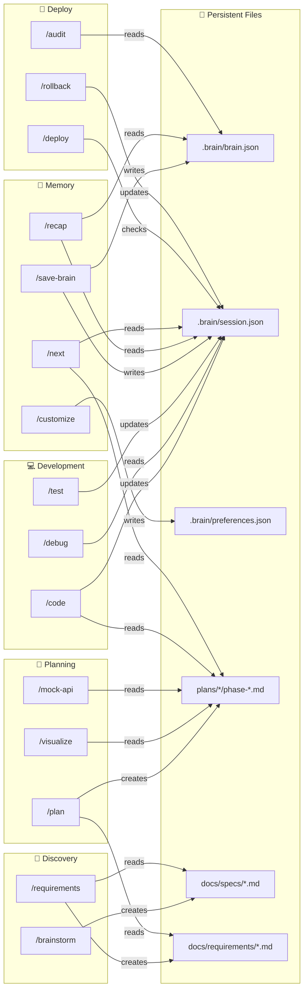
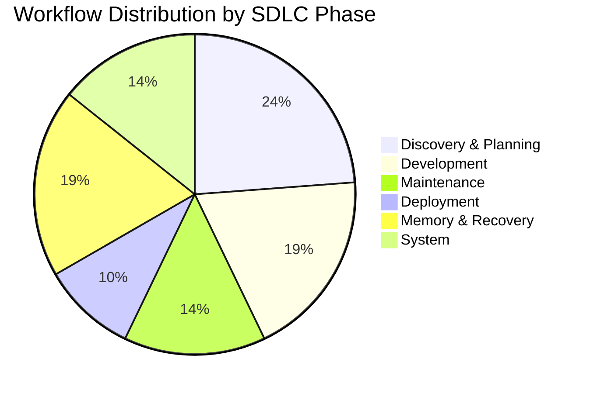

# Mine Workflow Flowchart v3.5

## 📋 Complete Workflow List (21 Workflows)

```
┌─────────────────────────────────────────────────────────────────────────────┐
│                        Mine WORKFLOW CATALOG v3.5                            │
├─────────────────────────────────────────────────────────────────────────────┤
│                                                                             │
│  🌟 DISCOVERY & START                                                       │
│  ├── /brainstorm    💡 Bàn ý tưởng, research thị trường                     │
│  ├── /requirements  📋 Phân tích & Đặc tả Yêu cầu (IEEE 830 SRS) ⭐ NEW     │
│  ├── /init          ✨ Tạo dự án mới hoàn chỉnh                             │
│  └── /customize     ⚙️  Cá nhân hóa AI persona                              │
│                                                                             │
│  🎯 PLANNING & DESIGN                                                       │
│  ├── /plan          📝 Thiết kế tính năng (Auto-generate phases)            │
│  ├── /visualize     🎨 Thiết kế UI/UX mockups                               │
│  └── /mock-api      💃 Giả lập Backend API (MSW + Faker)                    │
│                                                                             │
│  💻 DEVELOPMENT                                                             │
│  ├── /code          🔧 Viết code theo Spec (Auto Test Loop)                 │
│  ├── /run           ▶️  Khởi động app                                       │
│  ├── /test          ✅ Kiểm tra logic                                       │
│  └── /debug         🐞 Sửa lỗi & Debug                                      │
│                                                                             │
│  🔧 MAINTENANCE                                                             │
│  ├── /refactor      🧹 Dọn dẹp & tối ưu code                                │
│  ├── /audit         🏥 Kiểm tra code & bảo mật                              │
│  └── /rollback      ⏪ Quay lại phiên bản cũ                                │
│                                                                             │
│  🚀 DEPLOYMENT                                                              │
│  ├── /deploy        🌐 CI/CD + Deploy Production                            │
│  └── /cloudflare-tunnel  🔗 Expose app ra internet                          │
│                                                                             │
│  🧠 MEMORY & RECOVERY                                                       │
│  ├── /save-brain    💾 Lưu kiến thức dự án                                  │
│  ├── /recap         📖 Tóm tắt context khi quay lại                         │
│  └── /next          ➡️  Không biết làm gì tiếp?                             │
│                                                                             │
│  🔄 SYSTEM                                                                  │
│  └── /mine-update   🔄 Cập nhật Mine lên phiên bản mới                      │
│                                                                             │
└─────────────────────────────────────────────────────────────────────────────┘
```

---

## Main Flow (Beginner Path)

```mermaid
flowchart TD
    subgraph Discovery["🌟 Discovery & Start"]
        IDEA[/"Có ý tưởng"/] --> BRAINSTORM[/brainstorm]
        BRAINSTORM --> |BRIEF.md| REQ[/requirements]
        REQ --> |Use Cases, NFRs| INIT[/init]
        INIT --> |Project setup| PLAN[/plan]
    end

    subgraph Planning["🎯 Planning Phase"]
        PLAN --> |Auto-generate| PHASES[(plans/\nphase-01.md\nphase-02.md\n...)]
        PHASES --> VIZ[/visualize]
        VIZ --> |mockups| MOCK{Need API?}
        MOCK --> |Yes| MOCKAPI[/mock-api]
        MOCK --> |No| CODE
        MOCKAPI --> CODE
    end

    subgraph Coding["💻 Coding Phase"]
        CODE[/code phase-01] --> |Auto-test| TEST_PASS{Tests?}
        TEST_PASS --> |PASS| NEXT_TASK[Next Task]
        TEST_PASS --> |FAIL 3x| SKIP_OR_FIX{Skip/Fix?}
        SKIP_OR_FIX --> |Fix| DEBUG[/debug]
        DEBUG --> CODE
        SKIP_OR_FIX --> |Skip| BLOCKED[(skipped_tests)]
        NEXT_TASK --> |Phase done| AUTO_SAVE[Auto-save\nsession.json]
        AUTO_SAVE --> NEXT_PHASE{More phases?}
        NEXT_PHASE --> |Yes| CODE
        NEXT_PHASE --> |No| REFACTOR_CHECK
    end

    subgraph Maintenance["🔧 Maintenance"]
        REFACTOR_CHECK{Need cleanup?} --> |Yes| REFACTOR[/refactor]
        REFACTOR_CHECK --> |No| DEPLOY_CHECK
        REFACTOR --> DEPLOY_CHECK
    end

    subgraph Deploy["🚀 Deploy Phase"]
        DEPLOY_CHECK{skipped_tests?} --> |Yes| BLOCKED
        BLOCKED --> |Must fix| DEBUG
        DEPLOY_CHECK --> |No| AUDIT[/audit]
        AUDIT --> DEPLOY[/deploy]
        DEPLOY --> TUNNEL{Need public URL?}
        TUNNEL --> |Yes| CF[/cloudflare-tunnel]
        TUNNEL --> |No| LIVE
        CF --> LIVE[/"🎉 App Live!"/]
    end

    subgraph Memory["🧠 Memory & Recovery"]
        SAVE[/save-brain] --> BRAIN[(brain.json\nsession.json)]
        BRAIN --> RECAP[/recap]
        RECAP --> |Resume| CODE
        LIVE --> SAVE
    end

    style BLOCKED fill:#ff6b6b,stroke:#c92a2a
    style LIVE fill:#51cf66,stroke:#2f9e44
    style AUTO_SAVE fill:#ffd43b,stroke:#fab005
    style REQ fill:#74c0fc,stroke:#1971c2
    style MOCKAPI fill:#b197fc,stroke:#7048e8
```

---

## Data Flow Between Workflows



---

## Detailed Workflow Chain

```
┌─────────────────────────────────────────────────────────────────────────────┐
│                           Mine WORKFLOW CHAIN v3.5                           │
├─────────────────────────────────────────────────────────────────────────────┤
│                                                                             │
│  DISCOVERY ──────────────────────────────────────────────────────────────►  │
│                                                                             │
│  ┌──────────┐    ┌────────────┐    ┌──────────┐    ┌──────────┐            │
│  │/brainstorm│───►│/requirements│───►│  /init   │───►│  /plan   │            │
│  │           │    │            │    │          │    │          │            │
│  │ BRIEF.md  │    │ Use Cases  │    │ project  │    │ phases/  │            │
│  │           │    │ NFRs, RTM  │    │ setup    │    │          │            │
│  └──────────┘    └────────────┘    └──────────┘    └──────────┘            │
│                                          │              │                    │
│                                          ▼              ▼                    │
│  DESIGN ─────────────────────────────────────────────────────────────────►  │
│                                                                             │
│  ┌──────────┐    ┌──────────┐                                              │
│  │/visualize│───►│ /mock-api│                                              │
│  │          │    │          │                                              │
│  │ mockups  │    │ MSW APIs │                                              │
│  └──────────┘    └──────────┘                                              │
│       │                                                                     │
│       ▼                                                                     │
│  CODING ─────────────────────────────────────────────────────────────────►  │
│                                                                             │
│  ┌─────────────────────────────────────────────────────────────────────┐   │
│  │                         /code LOOP                                   │   │
│  │                                                                      │   │
│  │   ┌─────────────┐    ┌─────────────┐    ┌─────────────┐             │   │
│  │   │ phase-01    │───►│ Auto-Test   │───►│ Auto-Save   │────┐        │   │
│  │   │ phase-02    │    │ (3x retry)  │    │ session.json│    │        │   │
│  │   │ ...         │    └──────┬──────┘    └─────────────┘    │        │   │
│  │   └─────────────┘           │                              │        │   │
│  │                             │ FAIL                         │        │   │
│  │                             ▼                              │        │   │
│  │                    ┌─────────────┐                         │        │   │
│  │                    │Skip? → Block│──────► skipped_tests    │        │   │
│  │                    │Fix?  → Debug│                         │        │   │
│  │                    └─────────────┘                         │        │   │
│  │                                                            │        │   │
│  │   ◄────────────────── Next Phase ─────────────────────────┘        │   │
│  └─────────────────────────────────────────────────────────────────────┘   │
│                                        │                                    │
│                                        ▼                                    │
│  MAINTENANCE ────────────────────────────────────────────────────────────►  │
│                                                                             │
│  ┌──────────┐    ┌──────────┐    ┌──────────┐                              │
│  │ /refactor│───►│  /audit  │───►│  /test   │                              │
│  │          │    │          │    │          │                              │
│  │ cleanup  │    │ security │    │ verify   │                              │
│  └──────────┘    └──────────┘    └──────────┘                              │
│                                        │                                    │
│                                        ▼                                    │
│  DEPLOY ─────────────────────────────────────────────────────────────────►  │
│                                                                             │
│  ┌──────────┐    ┌──────────┐    ┌───────────────┐    ┌──────────┐        │
│  │  Check   │───►│ /deploy  │───►│/cloudflare-   │───►│   LIVE   │        │
│  │ skipped? │    │          │    │    tunnel     │    │          │        │
│  └────┬─────┘    └──────────┘    └───────────────┘    └──────────┘        │
│       │                                                     │              │
│       │ BLOCKED if tests skipped                            │              │
│       ▼                                                     ▼              │
│  ┌──────────┐                                         ┌──────────┐        │
│  │  /debug  │                                         │/save-brain│        │
│  │  /test   │                                         │          │        │
│  └──────────┘                                         └──────────┘        │
│                                                                             │
│  RECOVERY ───────────────────────────────────────────────────────────────►  │
│                                                                             │
│  ┌──────────┐    ┌──────────┐    ┌──────────┐    ┌──────────┐              │
│  │  /recap  │───►│  /next   │───►│ Resume   │    │/rollback │              │
│  │          │    │          │    │ /code    │    │(emergency)│              │
│  │ brain.json│   │ progress │    │          │    │          │              │
│  │session.json   │ display  │    │          │    │          │              │
│  └──────────┘    └──────────┘    └──────────┘    └──────────┘              │
│                                                                             │
│  SYSTEM ─────────────────────────────────────────────────────────────────►  │
│                                                                             │
│  ┌──────────┐    ┌──────────┐                                              │
│  │/customize│    │/mine-    │                                              │
│  │          │    │  update  │                                              │
│  │ persona  │    │ version  │                                              │
│  └──────────┘    └──────────┘                                              │
│                                                                             │
└─────────────────────────────────────────────────────────────────────────────┘
```

---

## Session.json Data Flow

```
session.json
├── working_on
│   ├── feature ─────────► /recap (hiển thị)
│   ├── task ────────────► /recap, /next (hiển thị)
│   ├── current_plan_path ► /code (đọc phases)
│   ├── current_phase ───► /code, /next (resume)
│   └── status ──────────► /next (progress)
│
├── pending_tasks ───────► /recap, /next (todo list)
│
├── skipped_tests ───────► /recap (reminder)
│   └──────────────────► /deploy (BLOCK!)
│
├── recent_changes ──────► /recap (summary)
│
├── errors_encountered ──► /recap, /debug (context)
│
└── mock_api_status ─────► /mock-api, /code (MSW state) ⭐ NEW
```

---

## Workflow Dependencies

| Workflow | Reads From | Writes To | Blocks If |
|----------|------------|-----------|-----------|
| `/brainstorm` | - | docs/specs/BRIEF.md | - |
| `/requirements` | BRIEF.md | docs/requirements/*.md | - |
| `/init` | requirements | project files, .brain/ | - |
| `/plan` | docs/, brain.json | plans/, session.json | - |
| `/visualize` | plans/ | mockups | - |
| `/mock-api` | plans/, specs | mocks/*.ts | - |
| `/code` | plans/, session.json | *.ts, session.json | - |
| `/run` | package.json | - | - |
| `/test` | src/**/*.test.ts | session.json | - |
| `/debug` | session.json, logs | *.ts | - |
| `/refactor` | src/ | src/ | - |
| `/audit` | project files | reports | - |
| `/deploy` | session.json | - | skipped_tests > 0 |
| `/cloudflare-tunnel` | - | tunnel config | - |
| `/rollback` | git history | project files | - |
| `/save-brain` | project files | brain.json, session.json | - |
| `/recap` | brain.json, session.json | - | - |
| `/next` | session.json, plans/ | - | - |
| `/customize` | - | preferences.json | - |
| `/mine-update` | GitHub | workflows/*.md | - |

---

## Quality Level Flow

```
MVP ──────────────────────────────────────────────────────────────────────────►
│
│  /brainstorm → /plan → /code → syntax check only → /deploy (staging)
│
PRODUCTION ───────────────────────────────────────────────────────────────────►
│
│  /brainstorm → /requirements → /plan → /visualize → /mock-api
│       │
│       └───► /code → auto-test → fix loop → /audit → /deploy
│
ENTERPRISE ───────────────────────────────────────────────────────────────────►
│
│  /brainstorm → /requirements (full IEEE 830) → /plan → /visualize
│       │
│       └───► /code → unit + integration + e2e → /audit → CI/CD → /deploy
│                                                    │
│                                                    └───► /cloudflare-tunnel
```

---

## 🔄 Workflow Categories by SDLC Phase



| SDLC Phase | Workflows | Count |
|------------|-----------|-------|
| Discovery & Planning | `/brainstorm`, `/requirements`, `/init`, `/plan`, `/visualize` | 5 |
| Development | `/code`, `/run`, `/test`, `/mock-api` | 4 |
| Maintenance | `/debug`, `/refactor`, `/audit` | 3 |
| Deployment | `/deploy`, `/cloudflare-tunnel` | 2 |
| Memory & Recovery | `/save-brain`, `/recap`, `/next`, `/rollback` | 4 |
| System | `/customize`, `/mine-update` | 2 |
| **Total** | | **21** |

---

## 🎯 Quick Reference: When to Use Which Workflow

```
┌─────────────────────────────────────────────────────────────────────────────┐
│                         WORKFLOW DECISION TREE                               │
├─────────────────────────────────────────────────────────────────────────────┤
│                                                                             │
│  "Tôi có ý tưởng mới" ──────────────────────────► /brainstorm               │
│  "Cần phân tích yêu cầu chi tiết" ──────────────► /requirements             │
│  "Tạo dự án mới" ───────────────────────────────► /init                     │
│  "Thiết kế tính năng" ──────────────────────────► /plan                     │
│  "Thiết kế giao diện" ──────────────────────────► /visualize                │
│  "Cần fake API để dev frontend" ────────────────► /mock-api                 │
│  "Viết code" ───────────────────────────────────► /code                     │
│  "Chạy app để test" ────────────────────────────► /run                      │
│  "Kiểm tra logic" ──────────────────────────────► /test                     │
│  "Có lỗi cần sửa" ──────────────────────────────► /debug                    │
│  "Code cần dọn dẹp" ────────────────────────────► /refactor                 │
│  "Kiểm tra bảo mật" ────────────────────────────► /audit                    │
│  "Deploy lên production" ───────────────────────► /deploy                   │
│  "Cần URL public" ──────────────────────────────► /cloudflare-tunnel        │
│  "Rollback về bản cũ" ──────────────────────────► /rollback                 │
│  "Lưu kiến thức cuối buổi" ─────────────────────► /save-brain               │
│  "Quay lại sau thời gian nghỉ" ─────────────────► /recap                    │
│  "Không biết làm gì tiếp" ──────────────────────► /next                     │
│  "Đổi cách AI giao tiếp" ───────────────────────► /customize                │
│  "Cập nhật Mine" ───────────────────────────────► /mine-update              │
│                                                                             │
└─────────────────────────────────────────────────────────────────────────────┘
```
